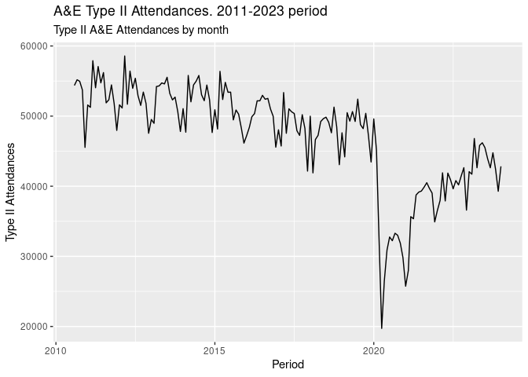
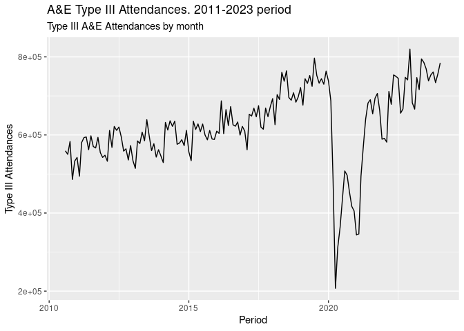

report
================
PLR
2024-04-02

## Setup

Load required packages first

``` r
# "tibble","tidyverse","here"
library(tibble)
library(tidyverse)
## ── Attaching core tidyverse packages ──────────────────────── tidyverse 2.0.0 ──
## ✔ dplyr     1.1.2     ✔ purrr     1.0.2
## ✔ forcats   1.0.0     ✔ readr     2.1.4
## ✔ ggplot2   3.4.3     ✔ stringr   1.5.0
## ✔ lubridate 1.9.2     ✔ tidyr     1.3.0
## ── Conflicts ────────────────────────────────────────── tidyverse_conflicts() ──
## ✖ dplyr::filter() masks stats::filter()
## ✖ dplyr::lag()    masks stats::lag()
## ℹ Use the conflicted package (<http://conflicted.r-lib.org/>) to force all conflicts to become errors
library(here)
## here() starts at /home/pablo/Documents/Pablo_zorin/Github_Pablo_source_zorin/targets-test
library(targets)
```

## Load Targets functions

We source required Target functions to create the output elements for
this report:

``` r
source(here("R","study_functions.R"))
```

## Create objects from functions

This adhoc. source_all() function can be used in the future to source
any new R script that we might save in the R folder. Where Targets will
look for sourcing any R script from.

``` r
source_all("R")
```

## Data all files combined

We check the final data frame created in the pipeline after merging all
three Attendances files

``` r
tar_read(one_two_combined) 
## # A tibble: 162 × 3
##    Period Type1_ATT Type2_ATT
##    <chr>      <dbl>     <dbl>
##  1 Aug-10   1138652     54371
##  2 Sep-10   1150728     55181
##  3 Oct-10   1163143     54961
##  4 Nov-10   1111295     53727
##  5 Dec-10   1159204     45536
##  6 Jan-11   1133881     51585
##  7 Feb-11   1053707     51249
##  8 Mar-11   1225222     57900
##  9 Apr-11   1197213     54042
## 10 May-11   1221687     57067
## # ℹ 152 more rows
```

## Type I Accident and Emergency Attendances plot

This section includes the plot for Type I A&E Attendances created in the
pipeline

``` r
tar_read(plot_1_report)
```

<!-- -->

## Type II Accident and Emergency Attendances

Total number of Type II A&E Attendances from 2011 to December 2023

``` r
tar_read(plot_2_report)
```

<!-- -->

## Type III Accident and Emergency Attendances

Total number of Type III A&E Attendances from 2011 to December 2023

``` r
tar_read(plot_3_report)
```

<!-- -->
