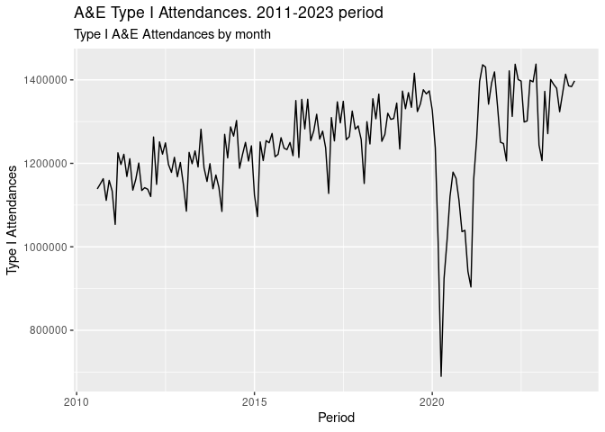

report
================
PLR
2024-01-08

## Setup

Load required packages first

``` r
# "tibble","tidyverse","here"
library(tibble)
library(tidyverse)
## ── Attaching core tidyverse packages ──────────────────────── tidyverse 2.0.0 ──
## ✔ dplyr     1.1.2     ✔ purrr     1.0.2
## ✔ forcats   1.0.0     ✔ readr     2.1.4
## ✔ ggplot2   3.4.3     ✔ stringr   1.5.0
## ✔ lubridate 1.9.2     ✔ tidyr     1.3.0
## ── Conflicts ────────────────────────────────────────── tidyverse_conflicts() ──
## ✖ dplyr::filter() masks stats::filter()
## ✖ dplyr::lag()    masks stats::lag()
## ℹ Use the conflicted package (<http://conflicted.r-lib.org/>) to force all conflicts to become errors
library(here)
## here() starts at /home/pablo/Documents/Pablo_zorin/Github_Pablo_source_zorin/Pipeline_functions/targets-test
library(targets)
```

## Load Targets functions

We source required Target functions to create the output elements for
this report:

``` r
source(here("R","study_functions.R"))
```

## Create objects from functions

This adhoc. source_all() function can be used in the future to source
any new R script that we might save in the R folder. Where Targets will
look for sourcing any R script from.

``` r
source_all("R")
```

## Data

We use now the output from each target to print the results in our
markdown report:

``` r
tar_read(data)
## # A tibble: 160 × 2
##    Datef      Att_TypeI
##    <date>         <dbl>
##  1 2010-08-01   1138652
##  2 2010-09-01   1150728
##  3 2010-10-01   1163143
##  4 2010-11-01   1111295
##  5 2010-12-01   1159204
##  6 2011-01-01   1133881
##  7 2011-02-01   1053707
##  8 2011-03-01   1225222
##  9 2011-04-01   1197213
## 10 2011-05-01   1221687
## # ℹ 150 more rows
```

## Plot

In the same way we display the plot from our Targets pipeline in this
last section

``` r
tar_read(plot)
```

<!-- -->
